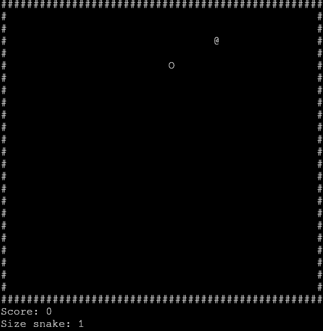

# Snake
A classic “Snake” game that focuses on solid gameplay and responsive controls. Guide the snake to eat food and grow, whilst avoiding the walls and its own tail.

## Features
- Continuous monitoring of the current count and the length of the snake on the screen
- A detailed summary of the results (score and final snake length) before returning to the main menu
- Optimised command processing that eliminates delays and key sticking, even during rapid typing
## Installation
### Option 1: Download the archive
1. Download the release from [GitHub Releases](https://github.com/wyoeri/Snake/releases)
2. Extract the archive to any folder
3. Run the file:
    - Linux: wysnakegame
    - macOS/windows: the programme has been developed exclusively for Linux (POSIX-compatible systems). The current version does not support Windows or macOS.
### Option 2: Compilation from source files
1. Clone the repository:
    ```bash
    git clone https://github.com/wyoeri/Snake
    ```
2. Go to the project folder:
    cd SnakeGameWyoeri
3. Generate the build files using Makefile:
    make
4. Go to the build folder:
    cd build
5. After compilation, run the binary file located in the build folder:
    ./wysnakegame
## License
Copyright (c) wyoeri.  
Licensed under the [MIT](LICENSE.txt) license.